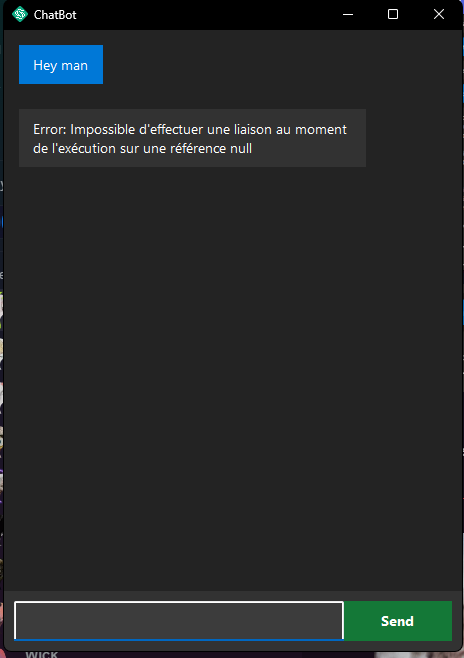

# ChatBot 

## Overview
This is a simple chatbot application created using WinForms in C#. The chatbot simulates a conversation between a user and a bot, where the user can type messages, and the bot responds with pre-configured or dynamically generated responses. The bot also shows a "typing..." animation while waiting for a response.

## Features
- **User Message Bubbles**: User's messages are displayed in blue bubbles aligned to the right.
- **Bot Message Bubbles**: The bot's responses appear in gray bubbles aligned to the left.
- **Typing Indicator**: The bot shows a "typing..." indicator with animated dots while waiting for a response.
- **Message Animation**: The bot's responses appear letter by letter, simulating typing.
- **Customizable UI**: The application features a clean, minimalistic interface with panels and labels for displaying messages.

## Requirements
- **.NET Framework**: 4.7 or higher.
- **Visual Studio** or any compatible IDE to compile and run the project.

## Setup Instructions
1. Clone the repository or download the source files.
2. Open the project in Visual Studio.
3. Build and run the application.

## Usage
- Type a message in the input box at the bottom of the window.
- Press **Enter** to send the message.
- The bot will reply after a brief "typing..." animation.

## Customization
You can change the appearance of the chat bubbles and the bot’s typing behavior by modifying the respective parts in the `ChatBot.cs` file.
